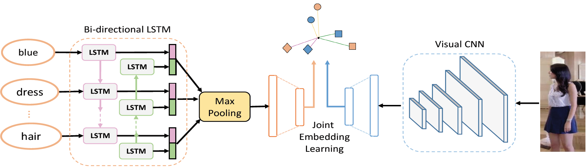

# Cross-Modal-Projection-Learning

TensorFlow implementation of **[Deep Cross-Modal Pojection Learning for Image-Text Matching](https://drive.google.com/file/d/1Xp285WFwTZIE6nVu5Hi54ar4fodKsmjy/view)** accepted by ECCV 2018.

## Introduction
We propose a cross-modal projection matching (CMPM) loss and a cross-modal projection classication (CMPC) loss for learning discriminative image-text embeddings. 



## Requirements

1. TensorFlow 1.4.0
2. CUDA 8.0 and cuDNN 6.0
3. Python 2.7

## Usage

### Data Preparation
1. Please download [Flickr30k Dataset](http://web.engr.illinois.edu/~bplumme2/Flickr30kEntities/) (About 4.4GB)

2. Please download [JSON Annotations](https://cs.stanford.edu/people/karpathy/deepimagesent/)

3. Convert the Flickr30k image-text data into TFRecords (About 15GB)
```
cd builddata & sh scripts/format_and_convert_flickr.sh 0
```

### Training
1. Please Download Pretrained [ResNet-v1-152](https://github.com/tensorflow/models/tree/master/research/slim) checkpoint

2. Train CMPM with ResNet-152 + Bi-LSTM on Flickr30k
```
sh scripts/train_flickr_cmpm.sh 0
```

3. Train CMPM + CMPC with ResNet-152 + Bi-LSTM on Flickr30k
```
sh scripts/train_flickr_cmpm_cmpc.sh 0
```

### Testing
1. Compute R@K(k=1,5,10) for image-to-text and text-to-image retrieval evaluation on Flickr30k
```
sh scripts/test_flickr_cmpm.sh 0
```

### More Datasets
1. We also provide the code for [MSCOCO](http://cocodataset.org/#download) and [CUHK-PEDES](https://github.com/ShuangLI59/Person-Search-with-Natural-Language-Description), which has similar preparation&training&testing procedures with Flickr30k

2. Be careful with the disk space (The MSCOCO may cost 20.1GB for images and 77.6GB for TFRecords)


## Citation
If you find CMPL useful in your research, please kindly cite our paper:

```
@inproceedings{ying2018CMPM,
    author = {Ying Zhang and Huchuan Lu},
    title = {Deep Cross-Modal Projection Learning for Image-Text Matching},
    booktitle = {ECCV},
    year = {2018}}
```
## Contact
If you have any questions, please feel free to contact zydl0907@mail.dlut.edu.cn